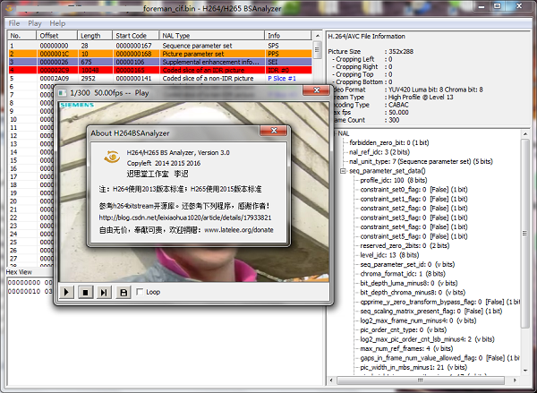
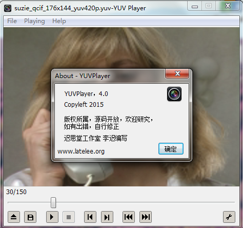

## 软件作品
### H.264/H.265码流分析播放器
基于MFC界面，以h264bitstream为核心库构建H264码流分析器。在此基础上独立完成H.265码流分析，合而为一，利用ffmpeg实现播放裸码流及保存图片功能。源码开源，地址：[https://github.com/latelee/H264BSAnalyzer](https://github.com/latelee/H264BSAnalyzer)  
  

### YUV播放器
基于MFC界面，支持常见Y、YUV420、YUV422、RGB等格式文件的播放，支持单帧图片保存成YUV或BMP文件。源码开放，地址：[https://github.com/latelee/YUVPlayer](https://github.com/latelee/YUVPlayer)  
  
